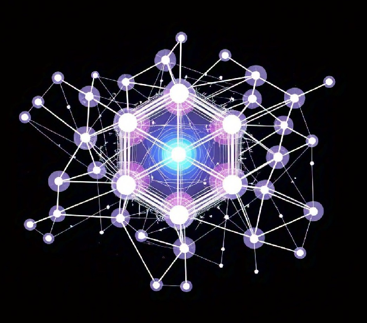
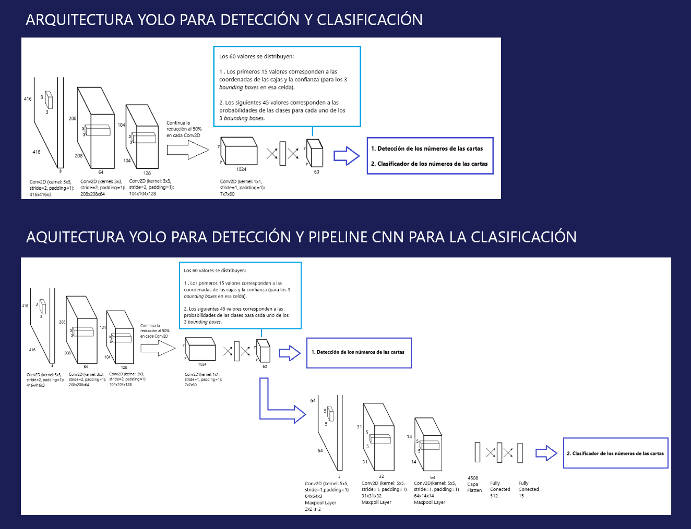
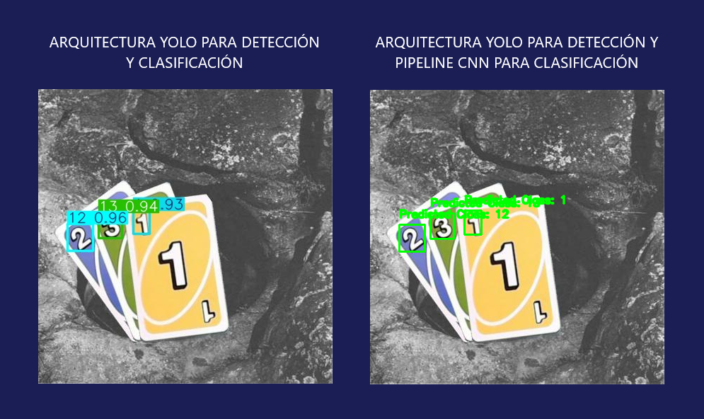

# **Modelos CNN de Detección de objetos** 


Realizar una comparación de desempeño de las siguientes redes neuronales propuestas:

1. Arquitectura YOLO de detección y clasificación de objetos
2. Arquitectura YOLO de detección y Pipeline de clasificación de objetos.

sobre un dataset de imagenes de cartas del juego de mesa UNO.

El modelo debe identifcar la ubicación de lo números de las cartas (del 1 al 15), y de que número se trata.
Además, generan artefactos que permitan analizar la el desempeño de la red.

---

## **Tabla de Contenidos**
1. [Resumen](#resumen)  
2. [Características](#características)  
3. [Instalación](#instalación)
4. [Elementos](#ielementos)
5. [Arquitecturas](#arquitecturas)
6. [Resultados](#resultados)
7. [Créditos](#créditos)
8. [Autor](#alumno) 
9. [Contacto](#contacto)   

---

## **Resumen**
En este trabajo se buscó desarrollar dos modelos de detección y clasificación de objetos. Por un lado se realizó un modelo con arquitectura YOLO para la detección y clasificación de objetos. Por otro lado, se desarrolló un pipeline a partir de la arquitectura mencionada: tomando los objetos detectados, se desarrolló una CNN para clasificar de forma independiente.

Se utilizó de conjunto de datos una colección de imágenes de cartas del juego UNO, todas debidamente etiquetadas, donde los objetos son los números de las cartas.

Este conjunto de datos pertenece a la colección *Roboflow100,* (RF100). Como inciativa patrocinada por Intel, RF100 tiene por objetivo crear un punto de referencia accesible, transparente y de código abierto para los modelos de detección de objetos de aprendizaje automático destinados a afirmar la generalidad mediante conjuntos de datos rastreados.

---

## **Características**
- 🖊️ Confiabilidad.  
- 💽 Disponibilidad de espacio.  
- 💻​ Mediano costo computacional.  
- 📝 Investigativo.

---

## **Instalación**
Pasos para instalar y configurar el proyecto:  

### Requisitos Previos 
-  
- 🛜 Acceso a internet  

### Pasos
1. Clona el repositorio:  
   ```bash  
   git clone https://github.com/fabriciolopretto/CNN_Model_YOLO_Object_Detection.git  
   cd CNN_Model_YOLO_Object_Detection

---

## **Elementos**
1. Notebooks con desarrollo de los modelos propuestos.
2. Conjunto de imagenes y etiquetas para entrenamiento, prueba y validación.
3. Artefactos.

---

## **Arquitecturas**


---

## **Resultados**


---
## **Créditos**
Agradecimientos a las siguientes bibliotecas y recursos:

- Matplotlib
- Numpy
- Pytorch
- [Roboflow100 - UNO Deck](https://universe.roboflow.com/roboflow-100/uno-deck/browse?queryText=&pageSize=50&startingIndex=0&browseQuery=true)

---

## **Autor**
Lic. Fabricio Lopretto </h1>.

---

## **Contacto**
Para dudas o sugerencias, contacto en:
<a href="mailto:fabriciolopretto@gmail.com.ar">
  
</a>
<a href="https://www.linkedin.com/in/fabricio-lopretto-scientific-analyst/"></a>
